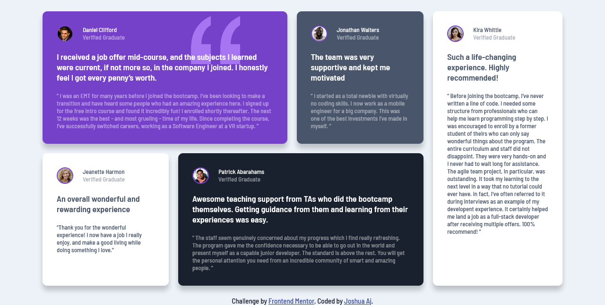

# Frontend Mentor - Testimonials grid section solution

This is a solution to the [Testimonials grid section challenge on Frontend Mentor](https://www.frontendmentor.io/challenges/testimonials-grid-section-Nnw6J7Un7). Frontend Mentor challenges help you improve your coding skills by building realistic projects. 

## Table of contents

- [Overview](#overview)
  - [The challenge](#the-challenge)
  - [Screenshot](#screenshot)
  - [Links](#links)
- [My process](#my-process)
  - [Built with](#built-with)
  - [What I learned](#what-i-learned)
  - [Continued development](#continued-development)
  - [Useful resources](#useful-resources)
- [Author](#author)

<!-- **Note: Delete this note and update the table of contents based on what sections you keep.** -->

## Overview

### The challenge

Users should be able to:

- View the optimal layout for the site depending on their device's screen size

### Screenshot



### Links

- Solution URL: [Add solution URL here]([https://your-solution-url.com](https://www.frontendmentor.io/solutions/responsive-teastimonials-section-using-css-grid-4lJkpGrz9a))
- Live Site URL: [Add live site URL here]( https://joshuaaj003.github.io/testimonials-grid-section/)

## My process

### Built with

- Semantic HTML5 markup
- CSS custom properties
- Flexbox
- CSS Grid

### What I learned
this project was my first use of css grid, I got to use several grid properties and attributes most notably span
To see how you can add code snippets, see below:

```css
.card {
    border-radius: 10px;
    box-shadow: 0 10px 10px rgba(0, 0, 0, 0.2);
    padding: 30px;
    transition: transform 1s;
    cursor: pointer;
}
.card__1 {
    background-color: var(--moderate-violet);
    background-image: url("./images/bg-pattern-quotation.svg");
    background-repeat: no-repeat;
    background-position: top 10px right 100px;
    grid-column: 1/4;
    grid-row: 1;
    transition: background-position 2s;
}
.card__2 {
    background-color: var(--dark-grey);
    grid-column: 4;
    grid-row: 1;
}

.card__3 {
    background-color: var(--white);
    color: var(--dark-grey);
    grid-column: 1;
    grid-row: 2;
}

.card__4 {
    background-color: var(--dark-greyish-blue);
    grid-column: 2/5;
    grid-row: 2;
}

.card__5 {
    background-color: var(--white);
    color: var(--dark-grey);
    grid-column: 5;
    grid-row: 1/3;
}

```


### Continued development

I look forward to using css grid and flex box for future projects for they cut down the difficulty of positioning elements by a great amount

### Useful resources

- [Example resource 1](www.w3schools.com) - The css documentation on the site really helped me out on this one. I really liked it and will use it going forward.
- [Example resource 2](https://www.youtube.com/watch?v=0xMQfnTU6oo) - This is an amazingly informative crash course done by Brad Trversy himself, I recomend it to anyone looking to learn the basics of css grid 


## Author

- Website - [Joshua Aj](https://github.com/joshuaAj003)
- Frontend Mentor - [@joshuaAj003](https://www.frontendmentor.io/profile/yourusername)
- Twitter - [@JAjorgbor](https://www.twitter.com/JAjorgbor)


